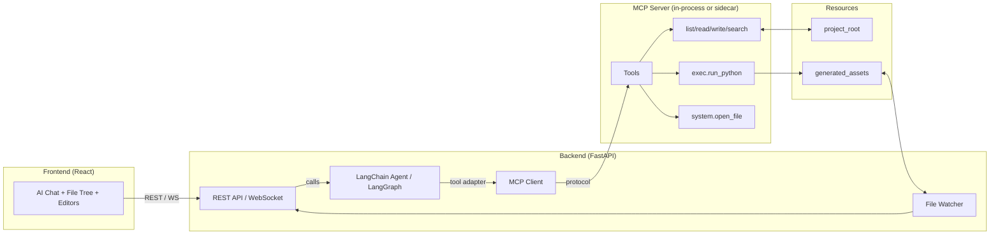
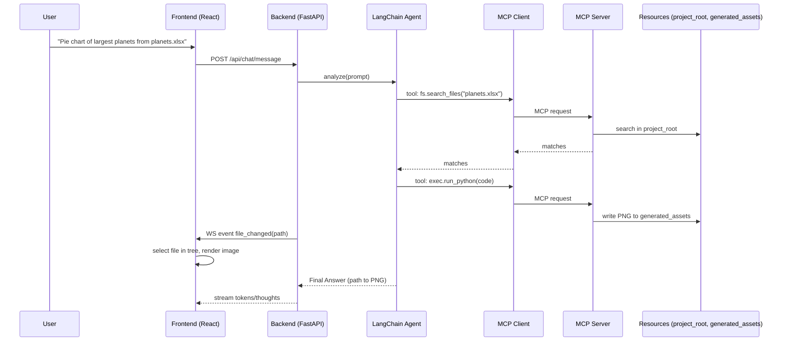

### MCP + LangChain Architecture (IDE for Text)

This document describes how to integrate MCP (Model Context Protocol) with our existing project so the agent can use standardized tools while LangChain remains the orchestration layer.

## Goals
- **Standardize tool invocation via MCP**: vendor‑neutral, hot‑pluggable tools.
- **Keep LangChain as the agent planner/executor**: ReAct/LangGraph, streaming, callbacks.
- **Preserve current UX**: generated files appear in the workspace and auto‑focus in the file tree.
- **Improve safety, observability, and portability**.

## High‑Level Overview
- **LangChain (Agent/Graph)**: Plans, reasons, decides which tools to call, streams thoughts/events to the frontend.
- **MCP**: Exposes tools/resources over a standard protocol (stdio or WebSocket). Tools can be local or external.
- **Backend (FastAPI)**: Hosts the LangChain agent and optionally the MCP server endpoint; continues to provide REST for the frontend.
- **Frontend (React)**: Unchanged; uses existing REST and WebSocket to display files, images, tables, and agent output.

## Architecture Diagrams

### Component Diagram

### Sequence (Typical Flow)

## Key Roles
- **LangChain stays**:
  - Orchestrates ReAct/LangGraph loop.
  - Manages LLM (Claude), session state, streaming callbacks, and logging.
  - Provides thin Tool adapters that delegate calls to the MCP client.
- **MCP provides tools**:
  - File operations, search, and execution (Python) as protocol‑compliant tools.
  - Tools can be swapped/extended without changing the agent logic.

## Components
- `LangChain Agent` (backend):
  - Prompts, memory/session, callbacks (streaming thoughts, execution traces).
  - Tool adapters: each adapter calls the MCP client with a tool name and arguments.
- `MCP Server` (backend process or in‑process):
  - Tools:
    - `fs.list_directory(path)`
    - `fs.read_file(path)`
    - `fs.write_file(path, content)`
    - `fs.search_files(query, root, globs?)`
    - `exec.run_python(code, workdir, resources?, timeout?)`
    - `system.open_file(path)` (optional)
  - Resources:
    - `project_root` (read/write, whitelisted)
    - `generated_assets` (read/write, output images/csv)
- `MCP Client`:
  - Thin client used by LangChain tools to call MCP server methods.
- `FastAPI` REST:
  - Keeps endpoints like `GET /api/file-tree`, `GET /api/file-content`, `POST /api/open-file`, WebSocket events (e.g., `file_changed`).

## Typical Flow (example: “pie chart of largest planets from planets.xlsx”)
1. User asks in chat.
2. LangChain agent plans: search → inspect → generate + run Python → return file path.
3. Agent calls MCP tools:
   - `fs.search_files(query="planets.xlsx", root=project_root)`
   - `fs.read_file(path)` if needed to infer schema, or directly `exec.run_python(code=...)`
   - `exec.run_python` writes `generated_assets/planets_pie_<timestamp>.png`
4. Backend watches file system and emits a `file_changed` event with the new file path.
5. Frontend selects the new file in the tree and displays it (image viewer).
6. Agent returns a final answer with the path and optionally a preview link.

## Safety & Policy
- Path whitelist: all tools operate only inside `project_root` and `generated_assets`.
- `exec.run_python` sandbox:
  - Timeouts, limited builtins, no network, controlled imports, max memory/CPU.
  - Write access only to `generated_assets`.
- Input/output validation at the MCP boundary; explicit MIME checks for serving files.

## Observability
- Every MCP call is logged with:
  - Tool name, arguments, start/end time, result summary.
  - Correlation ID / execution chain ID.
- LangChain callbacks stream thought/action/observation to the frontend console.
- Errors include actionable messages and, when safe, truncated traces.

## Error Handling (examples)
- File not found → agent retries with `fs.search_files` using a broadened query.
- Schema mismatch → agent inspects columns using a lightweight preview code block before plotting.
- Python execution error → return stderr/snippet, suggest fix or auto‑retry with safer code.

## Minimal MVP Scope
- MCP server with tools: `fs.*`, `exec.run_python`.
- LangChain tool adapters that call the MCP client.
- Generated artifacts saved to `test-directory/` or `generated_assets/`.
- File watcher continues to broadcast new files; frontend unchanged.

## Implementation Plan
- Backend
  - Add `backend/mcp_server.py` (Phase 1):
    - Implement stdio server first (simplest ops model). Export tools: `fs.list_directory`, `fs.read_file`, `fs.write_file`, `fs.search_files`, `exec.run_python`, `system.open_file`.
    - Bind resources: `project_root`, `generated_assets` with explicit RW policies.
    - Enforce sandboxing for `exec.run_python` (timeouts, safe builtins, allow‑list imports, write scope limited to `generated_assets`).
  - Add `backend/mcp_client.py` (Phase 1):
    - Thin wrapper with `request(tool_name, args)` and typed helpers. Retry/backoff on transport errors.
  - Add LangChain tool adapters in `backend/tools/` (Phase 2):
    - `MCPFileSearchTool`, `MCPFileReadTool`, `MCPFileWriteTool`, `MCPPythonExecTool` (strict arg schemas; good docstrings for the LLM).
  - Update `backend/ai_agent_manager.py` (Phase 2):
    - Switch the agent’s tool list to MCP adapters behind a feature flag `USE_MCP_TOOLS=true`.
  - Observability (Phase 2):
    - Callback handler logs (tool name, args summary, latency, status). Correlate with MCP request IDs.
  - Start‑up (Phase 1):
    - Update `start.sh` to launch MCP server (stdio) before FastAPI; add health checks and graceful shutdown.

- Frontend
  - No functional changes required.
  - Optional: add a console tab filter for MCP calls (tool, duration, result summary).

- Security & Policies (Phase 1–2)
  - Implement path allow‑list: deny any path outside `project_root`/`generated_assets`.
  - Memory/CPU/time caps for `exec.run_python`; kill long‑running processes.
  - Remove network from `exec.run_python` or gate it behind a separate, audited tool.
  - Redact sensitive arguments in logs.

- Testing Strategy
  - Unit tests: tool adapters (argument validation, error propagation), sandbox enforcement.
  - Integration tests: end‑to‑end prompts → PNG generated and listed in file tree.
  - Failure injection: missing files, schema mismatch, Python error; verify retries and user‑facing messages.

- Rollout Plan
  - Phase 1 (MCP server + client skeleton) behind feature flag; DirectAIAgent remains default.
  - Phase 2 (Agent uses MCP tools) on a dev branch; dogfood with typical prompts (visualization, joins, filters).
  - Phase 3 (Remove legacy direct tool wiring) after parity achieved; keep DirectAIAgent only for debugging.

- Configuration
  - Env vars: `USE_MCP_TOOLS`, `MCP_STDIO=1` (or `MCP_WS_URL`), `MCP_TIMEOUT_SEC`, `PY_EXEC_TIMEOUT_SEC`.
  - Paths: `PROJECT_ROOT`, `GENERATED_ASSETS` (default to `test-directory/` subfolders).

- Deliverables
  - Code: `mcp_server.py`, `mcp_client.py`, MCP tool adapters, agent wiring.
  - Docs: usage guide for external MCP clients (Claude Desktop/CLI), internal dev guide.
  - Demos: scripts/requests showcasing file search → python exec → image output.

## Tool Interface (conceptual)
- `fs.search_files`
  - Args: `{ query: string, root?: string, globs?: string[] }`
  - Returns: `{ matches: Array<{ path: string, size: number, mtime: number }> }`
- `fs.read_file`
  - Args: `{ path: string, maxBytes?: number }`
  - Returns: `{ path: string, contentBase64?: string, text?: string, mime?: string }`
- `fs.write_file`
  - Args: `{ path: string, contentBase64?: string, text?: string }`
  - Returns: `{ ok: true }`
- `exec.run_python`
  - Args: `{ code: string, workdir?: string, resources?: string[], timeoutSec?: number }`
  - Returns: `{ ok: true, stdout: string, stderr: string, outputs?: string[] }`
- `system.open_file`
  - Args: `{ path: string }`
  - Returns: `{ ok: true }`

## Security Defaults
- Deny everything outside whitelisted roots.
- Strip dangerous imports; provide safe `__builtins__`.
- Enforce per‑call timeouts and output size caps.
- Audit log for all `exec` calls.

## Migration Notes
- Keep existing direct tools for a short time as fallback.
- Roll out MCP tools behind a feature flag.
- Once stable, delete legacy direct tool wiring; keep `DirectAIAgent` only for debugging.

## Success Criteria
- Agent can solve “find / explore / transform / visualize” tasks using only MCP tools.
- New artifacts appear in the file tree and open automatically.
- Clear, streaming logs show MCP tool calls with full execution chain.
- No hardcoded paths; vague queries resolved via `fs.search_files`.

## Future Extensions
- Additional MCP tools: `sql.query`, `web.fetch`, `doc.parse` (PDF/CSV/Excel readers via standardized resources).
- Switch ReAct → LangGraph for explicit control flow and retries.
- Multi‑agent patterns (specialist graphs) still using the same MCP tools.

This document is the reference for implementing MCP integration while preserving LangChain as the orchestration layer.

