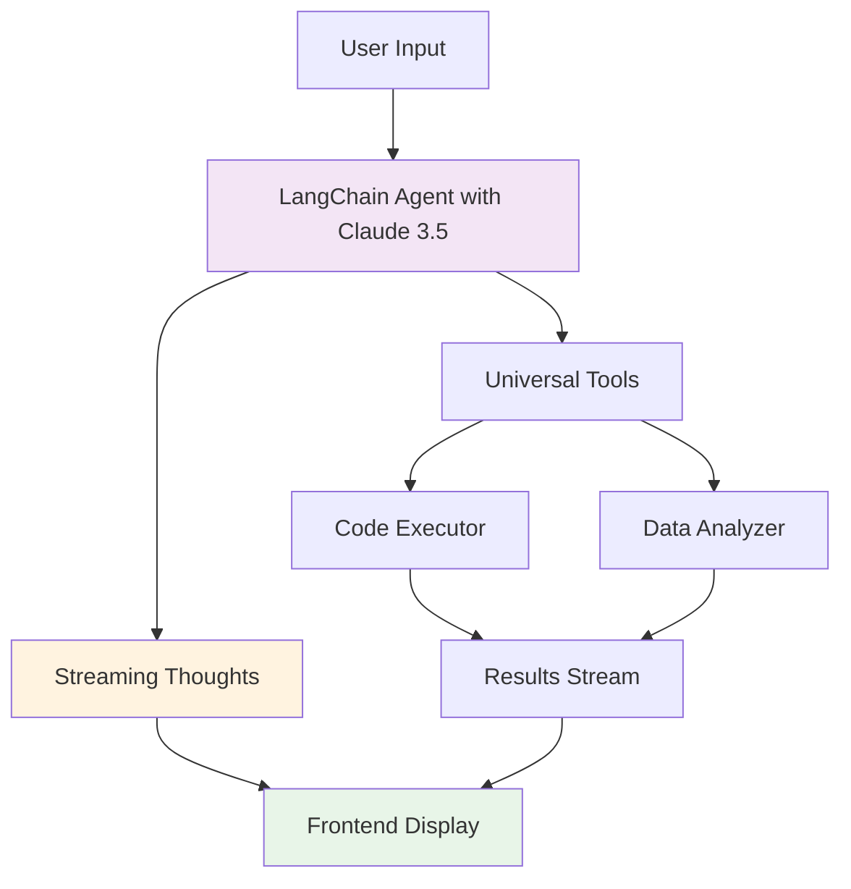

# AI Prompt Processing Workflow

## Overview

This document describes the simplified, transparent workflow for processing AI prompts in the Text IDE system, leveraging LangChain framework with Claude 3.5 for intelligent data analysis and code generation.

## Architecture Philosophy

**Core Principles:**
- **Transparency**: Show the AI's thinking process in real-time
- **Simplicity**: Minimal layers between user and AI
- **Streaming-first**: Immediate feedback on every step
- **Tool-focused**: Let LangChain handle orchestration

## Architecture Components

### Core Stack
- **Claude 3.5 Sonnet API**: Primary LLM for reasoning and code generation
- **LangChain Agent**: Orchestration with ReAct pattern
- **Streaming Callbacks**: Real-time thought process visibility
- **Universal Tools**: Simplified tool set for data analysis and code execution

### Frontend Integration
- **AI Chat Interface**: Real-time streaming of agent thoughts
- **Thinking Display**: Visual representation of reasoning chain
- **Progress Indicators**: Live execution status

## Simplified Workflow Example

Let's trace through the streamlined workflow with full transparency:

> **User Prompt**: *"Find correlations between sales and temperature in the file sales.xlsx and create a beautiful chart with trend analysis"*

---

## 🔄 Transparent Processing Flow

### 1. **Direct Agent Engagement with Streaming**

```python
# Single endpoint with streaming
@app.post("/api/ai/analyze")
async def analyze(request: AnalyzeRequest):
    agent = TransparentAgent(
        llm=Claude(model="claude-3-sonnet", streaming=True),
        callbacks=[StreamingThoughtCallback(websocket)]
    )
    
    async for event in agent.astream_events(request.query):
        yield event
```

**Real-time UI Updates:**
```
👤 User: "Find correlations between sales and temperature..."

🤖 AI Assistant (thinking out loud):
┌─ Planning ──────────────────────────────────┐
│ 🤔 Understanding request...                 │
│    Need to: analyze correlation + visualize │
│ 💭 Breaking down the task:                  │
│    1. Load Excel file                       │
│    2. Statistical analysis                  │
│    3. Create visualization                  │
└─────────────────────────────────────────────┘
```

### 2. **Transparent Tool Execution**

**Agent streams its reasoning:**
```python
# LangChain agent with explicit reasoning
agent_prompt = """You are a transparent AI assistant. 
Always explain your thinking process step by step.

Current task: {input}

Think step by step:
1. What do I need to do?
2. What tools should I use?
3. Explain each action before taking it.

{agent_scratchpad}
"""
```

**Live streaming to user:**
```
┌─ Executing ─────────────────────────────────┐
│ 🔧 Using DataAnalysisTool                   │
│    → Reading sales.xlsx structure...        │
│ ✓ Found: 365 rows, columns: date, sales,   │
│   temperature, region                       │
│ 💭 Good dataset for correlation analysis    │
│                                             │
│ 🔧 Using PythonExecutor                     │
│    → Computing Pearson correlation...       │
│ 📊 Writing analysis code...                 │
└─────────────────────────────────────────────┘
```

### 3. **Simplified Tool Architecture**

```python
# Two universal tools instead of many specialized ones
class UniversalDataTool(BaseTool):
    """Handles all data operations - reading, analyzing, transforming"""
    name = "data_tool"
    description = "Read and analyze any data file (Excel, CSV, JSON, etc.)"
    
    def _run(self, file_path: str, operation: str = "analyze"):
        # Single tool handles multiple operations
        if operation == "analyze":
            return self._analyze_file(file_path)
        elif operation == "transform":
            return self._transform_data(file_path)

class CodeExecutor(BaseTool):
    """Execute code with automatic result capture"""
    name = "code_executor"
    description = "Execute Python code for analysis and visualization"
    
    def _run(self, code: str):
        # Simplified execution with built-in safety
        return safe_execute(code, timeout=30)
```

### 4. **Streamlined Code Generation**

**Agent generates focused, minimal code:**

```python
# Streaming thought: "I'll use a template-based approach for cleaner code"
analysis_code = """
import pandas as pd
import matplotlib.pyplot as plt
from scipy.stats import pearsonr

# Load data
df = pd.read_excel('sales.xlsx')

# Calculate correlation
corr, p_value = pearsonr(df['temperature'], df['sales'])

# Create visualization
plt.figure(figsize=(10, 6))
plt.scatter(df['temperature'], df['sales'], alpha=0.6)
plt.xlabel('Temperature (°C)')
plt.ylabel('Sales')
plt.title(f'Correlation: {corr:.3f} (p={p_value:.3f})')

# Add trend line
z = np.polyfit(df['temperature'], df['sales'], 1)
p = np.poly1d(z)
plt.plot(df['temperature'], p(df['temperature']), "r--", alpha=0.8)

plt.savefig('correlation_analysis.png', dpi=150, bbox_inches='tight')
print(f"Analysis complete: r={corr:.3f}, p={p_value:.3f}")
"""

# Agent explains while coding:
# 💭 "Using minimal code for clarity"
# 💭 "Template approach reduces complexity"
# 💭 "Focus on core functionality"
```

### 5. **Direct Result Streaming**

```python
# Results stream directly as they're generated
async def stream_results(code_output):
    # Real-time streaming of execution
    yield {"type": "execution_start", "timestamp": now()}
    
    async for line in execute_streaming(code):
        yield {"type": "output", "content": line}
        
    yield {"type": "execution_complete", "files": generated_files}
```

**Live UI Updates:**
```
┌─ Results ───────────────────────────────────┐
│ ✓ Analysis complete: r=0.723, p<0.001       │
│ 📊 Visualization saved                      │
│ 💭 Strong positive correlation found        │
└─────────────────────────────────────────────┘
```

---

## Simplified Architecture Diagram



## Key Architecture Benefits

### 🎯 **Simplicity First**
- **Minimal Layers**: Direct connection between user and AI
- **Two Universal Tools**: Instead of many specialized ones
- **Streaming by Default**: No complex state management
- **LangChain Orchestration**: Let the framework handle complexity

### 👁️ **Full Transparency**
- **Visible Thinking**: Every reasoning step shown to user
- **Tool Explanations**: AI explains why it's using each tool
- **Progress Tracking**: Real-time status updates
- **Error Context**: Clear explanations when things go wrong

### ⚡ **Performance**
- **Streaming Everything**: Immediate feedback, no waiting
- **Minimal Overhead**: Fewer abstraction layers = faster response
- **Smart Caching**: Built into LangChain
- **Efficient Tools**: Universal tools reduce context switching

### 🔧 **Developer Experience**
- **Clean Architecture**: Easy to understand and modify
- **Standard Patterns**: Uses LangChain best practices
- **Minimal Dependencies**: Only essential packages
- **Clear Separation**: UI, Agent, Tools clearly defined

## Implementation Example

### Backend Setup with LangChain

```python
from langchain.agents import AgentExecutor, create_react_agent
from langchain_anthropic import ChatAnthropic
from langchain.callbacks import StreamingStdOutCallbackHandler
from langchain.tools import Tool

class TransparentAnalysisAgent:
    def __init__(self):
        # Initialize Claude 3.5 Sonnet
        self.llm = ChatAnthropic(
            model="claude-3-sonnet-20240229",
            streaming=True,
            callbacks=[StreamingStdOutCallbackHandler()]
        )
        
        # Define universal tools
        self.tools = [
            Tool(
                name="analyze_data",
                func=self.universal_data_tool,
                description="Analyze any data file format"
            ),
            Tool(
                name="execute_code",
                func=self.code_executor,
                description="Execute Python code for analysis"
            )
        ]
        
        # Create agent with transparent prompt
        self.agent = create_react_agent(
            llm=self.llm,
            tools=self.tools,
            prompt=self.get_transparent_prompt()
        )
    
    def get_transparent_prompt(self):
        return """You are a transparent AI assistant that explains your thinking.

For every task:
1. First explain what you understand
2. Share your analysis plan  
3. Explain each tool use
4. Interpret results clearly

Current task: {input}

{agent_scratchpad}"""
```

### Frontend Streaming Display

```typescript
// React component for displaying agent thoughts
const AgentThoughtStream: React.FC = () => {
    const [thoughts, setThoughts] = useState<ThoughtEvent[]>([]);
    
    useEffect(() => {
        const ws = new WebSocket('ws://localhost:8001/ws/agent');
        
        ws.onmessage = (event) => {
            const thought = JSON.parse(event.data);
            setThoughts(prev => [...prev, thought]);
        };
        
        return () => ws.close();
    }, []);
    
    return (
        <div className="thought-stream">
            {thoughts.map((thought, idx) => (
                <ThoughtBubble key={idx} thought={thought} />
            ))}
        </div>
    );
};
```

## Technical Stack

### Core Dependencies
- **LangChain**: v0.1.0+ for agent orchestration
- **Claude 3.5 Sonnet API**: Primary LLM (via Anthropic)
- **FastAPI**: WebSocket support for streaming
- **React**: Frontend with real-time updates

### Configuration
```yaml
llm:
  provider: anthropic
  model: claude-3-sonnet-20240229
  temperature: 0.3
  max_tokens: 4096
  streaming: true

tools:
  data_analyzer:
    timeout: 30s
    memory_limit: 512MB
  code_executor:
    sandbox: true
    allowed_imports: [pandas, numpy, matplotlib, seaborn, scipy]

ui:
  thought_display: true
  tool_transparency: true
  execution_streaming: true
```

---

*This simplified architecture maintains the power of LangChain while dramatically reducing complexity, providing users with full visibility into the AI's reasoning process.*