# AI Prompt Processing Workflow

## Overview

This document describes the comprehensive workflow for processing complex AI prompts in the Text IDE system, leveraging LangChain framework for intelligent data analysis, file processing, and code generation.

## Architecture Components

### Backend Services
- **LangChain Agent**: Orchestrates prompt analysis and tool selection
- **File Analysis Tools**: Excel/text file processing and data extraction
- **Code Generation Engine**: Python script generation for data analysis
- **Safe Execution Environment**: Sandboxed Python execution
- **Result Processing**: Output file management and response assembly

### Frontend Integration
- **AI Chat Interface**: User interaction and result display
- **File Preview**: Visual representation of generated outputs
- **Progress Tracking**: Real-time execution monitoring

## Detailed Workflow Example

Let's trace through a complete workflow using this example prompt:

> **User Prompt**: *"Find correlations between sales and temperature in the file sales.xlsx and create a beautiful chart with trend analysis"*

---

## 🔄 Step-by-Step Processing

### 1. **Input Reception**
```
Frontend → Backend → LangChain Agent
```

**What happens:**
- User enters prompt in AI chat interface
- Frontend sends POST request to `/api/ai/analyze`
- Backend receives: `{query: "...", file_paths: ["sales.xlsx"]}`

### 2. **Agent Planning Phase**
```python
FileAnalysisAgent.process_request()
```

**LangChain Agent Analysis:**
- **Task Identification**: Data analysis + visualization
- **File Assessment**: `sales.xlsx` 
- **Tool Selection**: excel_analysis, python_executor

**Agent Internal Reasoning:**
```
I need to:
1. First examine the Excel file structure
2. Find correlation between sales and temperature  
3. Create a visualization with trend line
4. Return the results

I'll use excel_analysis tool first, then python_executor.
```

### 3. **Tool Execution #1 - File Analysis**
```python
ExcelAnalysisTool.run("sales.xlsx")
```

**Processing:**
```python
df = pd.read_excel("sales.xlsx")
return f"""
File: sales.xlsx
Shape: (365, 4)
Columns: ['date', 'sales', 'temperature', 'region']
Data types: {'date': 'datetime64', 'sales': 'int64', 'temperature': 'float64', 'region': 'object'}
Sample data:
        date  sales  temperature region
0 2023-01-01   1200         -2.5   North
1 2023-01-02   1450          1.2   North
2 2023-01-03   1380         -0.8   North
"""
```

**Result**: Agent now understands the data structure ✅

### 4. **Agent Reasoning & Decision Making**

**Agent Strategic Planning:**
```
Data Structure Analysis Complete:
- sales column (int64) - dependent variable
- temperature column (float64) - independent variable  
- 365 rows of daily data - sufficient sample size
- Need correlation analysis + visualization

Next Action: Generate Python code for:
1. Statistical correlation calculation
2. Professional scatter plot with regression line
3. High-quality output generation
```

### 5. **Code Generation Phase**

**Agent generates optimized Python code:**

```python
generated_code = """
import pandas as pd
import matplotlib.pyplot as plt
import seaborn as sns
import numpy as np
from scipy.stats import pearsonr
import os

# Load and prepare data
df = pd.read_excel('/data/sales.xlsx')

# Calculate correlation statistics
correlation, p_value = pearsonr(df['sales'], df['temperature'])

# Create professional visualization
plt.style.use('seaborn-v0_8')
fig, ax = plt.subplots(figsize=(12, 8))

# Scatter plot with styling
scatter = ax.scatter(df['temperature'], df['sales'], 
                    alpha=0.6, s=60, c='steelblue', 
                    edgecolors='white', linewidth=0.5)

# Trend line calculation and plotting
z = np.polyfit(df['temperature'], df['sales'], 1)
p = np.poly1d(z)
ax.plot(df['temperature'], p(df['temperature']), 
        "r--", alpha=0.8, linewidth=2, label='Trend Line')

# Professional styling
ax.set_xlabel('Temperature (°C)', fontsize=14, fontweight='bold')
ax.set_ylabel('Sales', fontsize=14, fontweight='bold')
ax.set_title(f'Sales vs Temperature Correlation Analysis\\nPearson r = {correlation:.3f} (p = {p_value:.3f})', 
            fontsize=16, fontweight='bold', pad=20)

# Statistical information box
textstr = f'''Correlation Analysis:
• Pearson r: {correlation:.3f}
• P-value: {p_value:.3f}
• Relationship: {"Strong" if abs(correlation) > 0.7 else "Moderate" if abs(correlation) > 0.5 else "Weak"}
• Direction: {"Positive" if correlation > 0 else "Negative"}'''

props = dict(boxstyle='round', facecolor='wheat', alpha=0.8)
ax.text(0.05, 0.95, textstr, transform=ax.transAxes, fontsize=10,
        verticalalignment='top', bbox=props)

# Save high-quality output
plt.tight_layout()
output_path = '/temp/outputs/sales_temperature_correlation.jpg'
os.makedirs('/temp/outputs', exist_ok=True)
plt.savefig(output_path, dpi=300, bbox_inches='tight', facecolor='white')
plt.close()

# Generate comprehensive summary
summary = f'''
CORRELATION ANALYSIS RESULTS

📊 Statistical Summary:
- Correlation coefficient: {correlation:.4f}
- P-value: {p_value:.4f}
- Sample size: {len(df)} observations

📈 Interpretation:
- Strength: {"Strong" if abs(correlation) > 0.7 else "Moderate" if abs(correlation) > 0.5 else "Weak"} correlation
- Direction: {"Positive" if correlation > 0 else "Negative"} relationship
- Significance: {"Significant" if p_value < 0.05 else "Not significant"} (α = 0.05)

🎯 Business Insight:
{"Higher temperatures are associated with higher sales" if correlation > 0 else "Higher temperatures are associated with lower sales"}

📁 Generated Files:
- sales_temperature_correlation.jpg (visualization)
- analysis_summary.txt (this summary)
'''

with open('/temp/outputs/analysis_summary.txt', 'w') as f:
    f.write(summary)

print("✅ Analysis completed successfully!")
print(f"Correlation: {correlation:.4f}")
print(f"Output saved to: {output_path}")
"""
```

### 6. **Tool Execution #2 - Safe Code Execution**
```python
SafePythonTool.run(generated_code)
```

**Execution Process:**
1. **Sandbox Creation**: Creates isolated environment `/tmp/sandbox_12345/`
2. **Code Validation**: Checks for security violations
3. **Execution**: Runs code with 30-second timeout
4. **File Generation**: Creates output files
5. **Result Capture**: Captures stdout/stderr

**Execution Output:**
```
Exit code: 0
STDOUT:
✅ Analysis completed successfully!
Correlation: 0.7234
Output saved to: /temp/outputs/sales_temperature_correlation.jpg

STDERR:
(empty)
```

**Generated Files:**
- `/temp/outputs/sales_temperature_correlation.jpg` (High-quality visualization)
- `/temp/outputs/analysis_summary.txt` (Statistical summary)

### 7. **Result Processing & Assembly**

**Agent processes execution results:**
```python
result = {
    "status": "success",
    "execution_time": "3.2s",
    "statistical_results": {
        "correlation": 0.7234,
        "p_value": 0.0001,
        "interpretation": "Strong positive correlation",
        "significance": "Statistically significant"
    },
    "files_created": [
        {
            "type": "image",
            "title": "Sales vs Temperature Correlation",
            "path": "/temp/outputs/sales_temperature_correlation.jpg",
            "preview_url": "/api/files/preview/sales_temperature_correlation.jpg",
            "download_url": "/api/files/download/sales_temperature_correlation.jpg",
            "metadata": {
                "format": "JPEG",
                "resolution": "3600x2400",
                "size": "245KB"
            }
        },
        {
            "type": "text",
            "title": "Statistical Analysis Summary", 
            "path": "/temp/outputs/analysis_summary.txt",
            "preview_url": "/api/files/preview/analysis_summary.txt"
        }
    ],
    "summary": "Analysis reveals strong positive correlation (r=0.7234, p<0.001) between temperature and sales data..."
}
```

### 8. **Response Transmission**

**Backend → Frontend JSON Response:**
```json
{
  "message": "✅ Analysis completed! Found strong positive correlation (r=0.7234) between temperature and sales.",
  "results": [
    {
      "type": "image",
      "title": "Sales vs Temperature Correlation Analysis",
      "url": "/api/files/preview/sales_temperature_correlation.jpg",
      "downloadUrl": "/api/files/download/sales_temperature_correlation.jpg",
      "thumbnailUrl": "/api/files/thumbnail/sales_temperature_correlation.jpg"
    },
    {
      "type": "summary",
      "title": "Statistical Summary", 
      "content": "Strong positive correlation (r=0.7234, p<0.001) indicates that higher temperatures are significantly associated with increased sales..."
    }
  ],
  "taskId": "task_12345",
  "executionTime": "3.2s",
  "timestamp": "2024-01-15T10:30:45Z"
}
```

### 9. **Frontend UI Display**

**User Interface Presentation:**

```
🤖 AI Assistant
✅ Analysis completed! Found strong positive correlation (r=0.7234) between temperature and sales.

📊 [INTERACTIVE PREVIEW: sales_temperature_correlation.jpg]
   📥 Download (245KB) | 🔍 View Full Size

📋 Statistical Analysis Summary:
   • Correlation Coefficient: 0.7234 (strong positive)
   • P-value: < 0.001 (highly significant)  
   • Business Interpretation: Higher temperatures → Higher sales
   • Sample Size: 365 daily observations

⏱️ Completed in 3.2 seconds
```

---

## Complete Workflow Diagram

```mermaid
graph TD
    A[👤 User Input] --> B[🌐 Frontend]
    B --> C[🚀 FastAPI Backend]
    C --> D[🧠 LangChain Agent]
    
    D --> E[🔍 Tool Selection]
    E --> F[📊 Excel Analysis Tool]
    F --> G[📈 Data Understanding]
    
    G --> H[🤖 Code Generation]
    H --> I[⚙️ Python Execution Tool]
    I --> J[📁 File Generation]
    
    J --> K[✅ Result Processing]
    K --> L[📤 Response Assembly]
    L --> M[🎨 UI Display]
    
    style A fill:#e1f5fe
    style D fill:#f3e5f5  
    style I fill:#fff3e0
    style M fill:#e8f5e8
```



## Key Workflow Features

### 🧠 **Intelligent Decision Making**
- **Autonomous Tool Selection**: Agent automatically chooses appropriate tools based on prompt analysis
- **Context Awareness**: Understands file structure and data types before processing
- **Dynamic Planning**: Adapts strategy based on intermediate results

### 🔧 **Tool Orchestration**
- **Sequential Execution**: Tools are executed in logical order
- **Error Handling**: Graceful failure recovery with informative error messages
- **Resource Management**: Automatic cleanup of temporary files and processes

### 🔒 **Security & Safety**
- **Sandboxed Execution**: All code runs in isolated environments
- **Code Validation**: Security checks before execution
- **Resource Limits**: CPU/memory/time constraints on code execution
- **File Access Control**: Restricted file system access

### 📊 **Rich Output Generation**
- **Multi-format Results**: Images, text files, data summaries
- **Professional Visualizations**: High-quality charts and graphs
- **Statistical Analysis**: Comprehensive data insights
- **Interactive Previews**: Frontend integration for seamless viewing

### ⚡ **Performance Optimization**
- **Streaming Responses**: Real-time progress updates
- **Caching**: Intelligent caching of analysis results
- **Parallel Processing**: Concurrent tool execution where possible
- **Resource Pooling**: Efficient sandbox reuse

## Error Handling & Recovery

### Common Error Scenarios:
1. **File Access Errors**: Invalid file paths or permissions
2. **Code Execution Errors**: Python runtime exceptions
3. **Tool Selection Errors**: Inappropriate tool choices
4. **Resource Limit Errors**: Timeout or memory exhaustion

### Recovery Strategies:
- **Graceful Degradation**: Partial results when possible
- **Alternative Approaches**: Fallback tool selection
- **User Feedback**: Clear error explanations and suggestions
- **Automatic Retry**: For transient failures

## Future Enhancements

### Planned Features:
- **Multi-language Support**: R, SQL, JavaScript execution
- **Advanced Visualizations**: Interactive plots with Plotly
- **Machine Learning Integration**: Automated model training
- **Collaborative Features**: Shared analysis sessions
- **Version Control**: Analysis history and reproducibility

## Technical Implementation Notes

### Dependencies:
- **LangChain**: Core orchestration framework
- **Pandas**: Data manipulation and analysis
- **Matplotlib/Seaborn**: Visualization generation
- **FastAPI**: Backend API framework
- **React**: Frontend user interface

### Configuration:
- **Model**: deepseek-coder:6.7b (local Ollama deployment)
- **Execution Timeout**: 30 seconds default
- **Memory Limit**: 512MB per sandbox
- **File Size Limit**: 100MB per file
- **Concurrent Tasks**: 5 maximum

---

*This workflow documentation demonstrates the sophisticated AI-powered data analysis capabilities of the Text IDE system, showcasing how complex user prompts are intelligently processed and executed to deliver professional-grade results.*